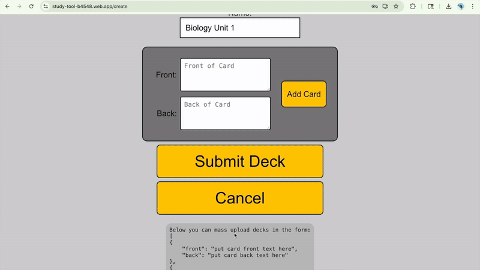
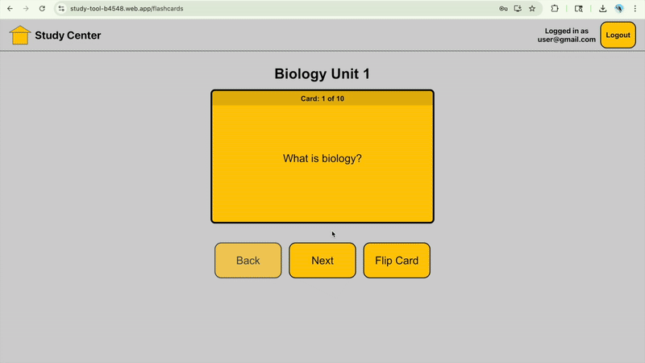
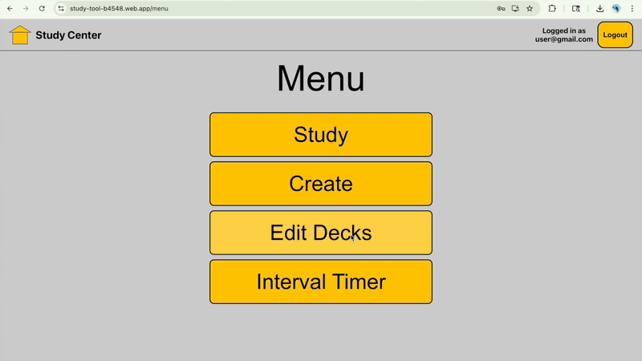
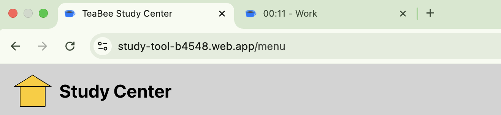
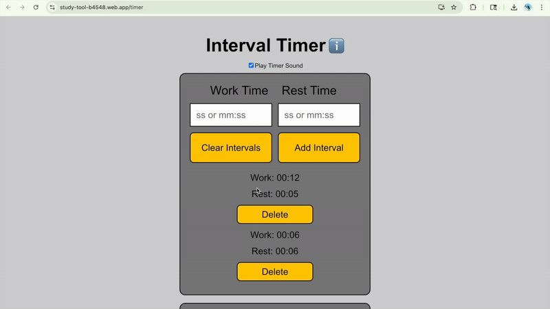

# LearningWebApp
A serverless web application created with React and hosted on Firebase. It supports user authentication with email/password or Google accounts. 

Live App: https://study-tool-b4548.web.app

## Overview
When I was in college, I encountered many professors who asked students not to upload their course material to Quizlet since then people can access it for free. The point of this app is to allow a more private alternative by restricting access to flashcards only to the user that uploaded them. 

Another purpose for this app is simply to give me experience in web development and UI design.

This app has two main features:
1. The ability to create, edit, and study private, virtual flashcard sets.
2. An interval timer that allows the user to specify work and rest intervals. This can be used as a Pomodoro timer to manage time during study sessions.

## 🛠️ Tech Stack
* Frontend: React, React Router, CSS3
* Backend/Database: Firebase Authentication, Firestore (serverless)
* Deployment: Firebase Hosting
* Other: Git, NPM

## 🔮 Status
✅ Core features (flashcards, private storage, interval timer) are complete.  
⚠️ This repo is no longer being actively developed.  

## Flashcards
Flashcard sets are linked to a user id, so a user can access their study sets from their laptop, phone, or tablet.

Flashcard creation can be done manually using my user friendly interface for creating and modifying card decks, or flashcard creation can be done via bulk upload in JSON format. 

### Get started fast with mass upload

### Study your flashcards

### View and modify the cards you created

## Interval Timer
Use the interval timer to manage your time while studying or doing work. The interval timer uses a browser's localStorage to save the most recently used intervals. It also allows a timer to maintain its state if a user accidentally refreshes or closes the page.

When a timer expires, a browser notification will show in addition to the timer display flashing and a chime sound playing.

### View the countdown in the browser tab

### The timer will keep working if you accidentally refresh or close the tab

